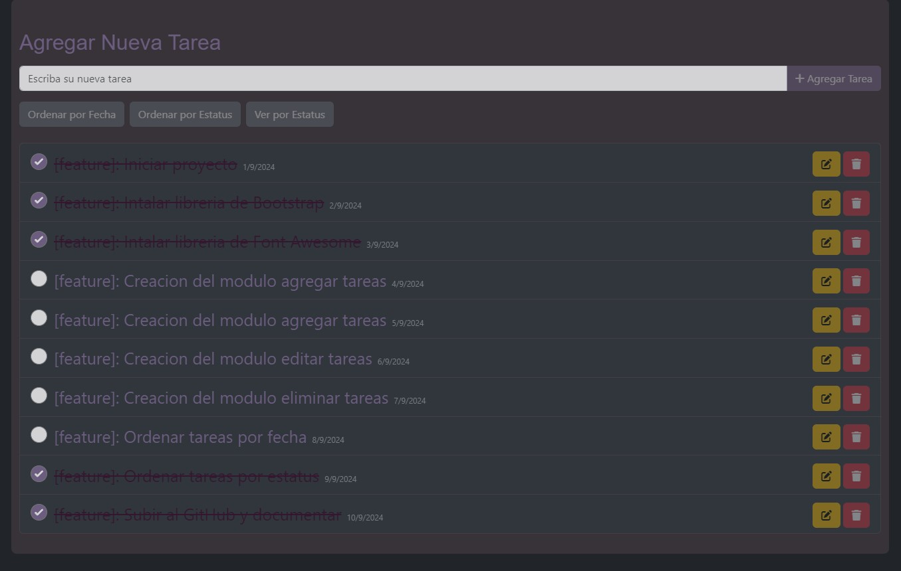

# Mini Administrador de Tareas en React JS

Proyecto en React JS con la metodología de diseño Atomic Design

## Investigación

Para comenzar este pequeño proyecto tuve que investigar la metodologia de diseño Atomic Design ya que no habia trabajado con ella, me parecio bastante interesante y facil de entender, inmediatamente luego de aprender su estructura cree el proyecto base de React JS y comence a diseñar la estructura de Atomos, Moleculas, Organismos, Plantillas y Paginas.


Luego tuve que investigar un poco sobre la caractaristica Context dentro de React JS para poder aplicar la misma, esta caracteristica permite que los datos o estados se puedan manejar entre componentes. 

## Decisiones tomadas

Para el diseño use la libreria de Bootstrap de igual manera le di un estilo diferente al proyecto creando su propia hoja de estilos y para los iconos la libreria de Font Awesome, tambien use las librerias de Axios para las peticiones asincronas al BackEnd

## Como comenzar

Clonar el proyecto localmente:

```shell
git https://github.com/hdcr1985/react-atomic-design.git
cd react-atomic-design
npm install
npm start
```

## Pantallas de la aplicación



## URL del FronEnd

```shell
http://localhost:3000
```

